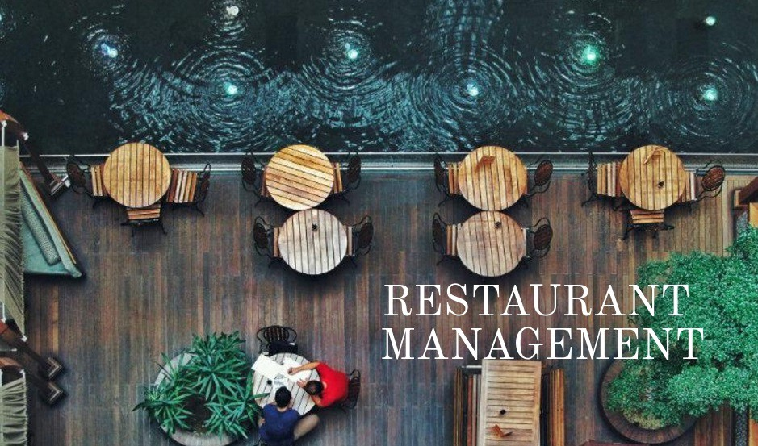

# restaurant-recommendation-system
The following project shows a restaurant recommendation program. By entering a type of food, the program recommends different restaurants of that cuisine:

  

Project Ideas:
Here are some topics you can create a recommendation software for:

Restaurants
Movies
Books
Television
Podcasts
Project Objectives:
Store data in a data structure
Use an algorithm to sort or search for data within a data structure
Use Git version control
Use the command line and file navigation
Write a technical blog post on the project
Prerequisites:
Introduction to Python
Data Structures and Algorithms
